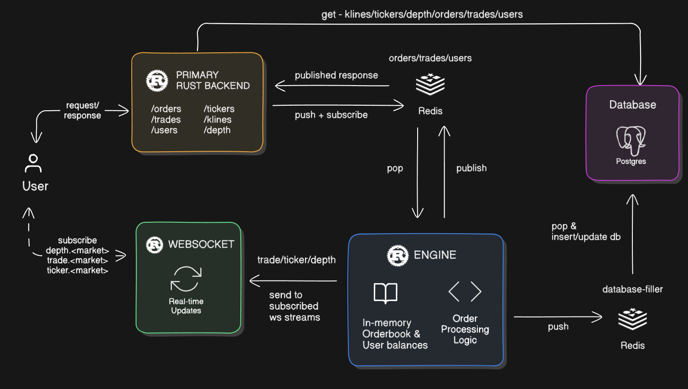

# **OrderTypes**

    - Market
    - GoodTillCancel, (Limit (GTC)) 
    - FillOrKill, (FOK)
    - FillAndKill, (IOC / FAK)
    - GoodForDay, (GFD) 
        - market are open 24/7, so no opening/closing auctions
    - Post-Only
    - Stop-Market
    - Stop-Limit
    - Reduce-Only
    - iceberg order (only a limit order)


- mataching engine orders
``` 
Market
GoodTillCancel //remaining impl
IOC
FOK
Post-Only // remaining impl
```


## LLD of the cex

1. **RedisManager**

   - Handles:
     - push
     - pop
     - publish
     - subscribe

2. **PostgresManager**


- order intent, the data to be stored
```
order_id
user_id
side (buy/sell)
price
quantity
filled_quantity
status
timestamp
```

3. **Router**

   Routes `/api/v1`:

   - `/order`

     - **POST** `/` : Create a new order
     - **GET** `/` : Get order (check status)
     - **DELETE** `/` : Cancel active order
     - **GET** `/open` : Get open orders

   - `/klines` : Get kline data directly from the database

     - **Query params**:
       - `market`
       - `interval`
       - `startTime`
       - `endTime`

   - `/user`
     - **POST** `/new` : Create new user
     - **GET** `/` : Get user details
     - **POST** `/deposit` : Deposit
     - **POST** `/withdraw` : Withdraw
     - **GET** `/order` : View user order history

```
Before accepting an order:
Exchange locks funds
Validates balance
Rejects if insufficient
```

4. **Engine**

   - **Main**
     - Basic HTTP server using `tokio` that continuously pops from Redis queue.

   a) **Orderbook**

   - **Struct**:

     ```rust
     struct {
       bids: BTreeMap<Decimal, Vec<Order>>,
       asks: BTreeMap<Decimal, Vec<Order>>,
       asset_pair: AssetPair,
       last_update_id: i64,
     }
     ```

     **Order Struct**:

     ```rust
     struct Order {
       order_id: String,
       user_id: String,
       symbol: String,        // SOL_USDC
       side: String,          // Buy/Sell
       order_type: String,    // Limit/Market
       order_status: String,
       quantity: Decimal,
       filled_quantity: Decimal,
       price: Decimal,
       timestamp: i64,
     }
     ```

   - **Impl**:
     - `process_order(order: OrderInput)`
       - Match based on `side` (buy/sell)
       - All orders are limit orders
     - `get_order()`
     - `get_open_orders()`
     - `cancel_order()`
     - `cancel_all()`

   b) **Engine**

   - **Structs**:

     - `Amount`:

       ```rust
       struct Amount {
         available: Decimal,
         locked: Decimal,
       }
       ```

     - `UserBalances`:

       ```rust
       struct UserBalances {
         user_id: String,
         balance: HashMap<Asset, Amount>,
       }
       ```

     - `Engine`:
       ```rust
       struct Engine {
         orderbooks: Vec<Orderbook>,
         balances: BTreeMap<String, UserBalances>,
       }
       ```

   - **Impl**:
     - `process_order(message_from_redis)`
       - Match the type of message from Redis and perform actions.
       - Handles pub/sub.
     - `add_orderbook()`
     - `create_order()`: Adds order to the orderbook after verifying user balances.
     - `update_order()`


**AI alert**
```
tests are written using AI
```
